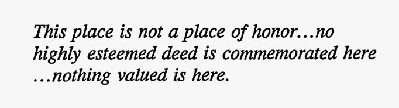

# goatcounter-explore

> [!CAUTION]
> 
> 
> This code was authored with minimal supervision/review by Gemini 3 Pro in
> Antigravity. It may be very bad.
>
> It is my general policy not to publicize slop, but I want to provide this
> source as evidence that this application does not store your GoatCounter data
> except perhaps in localstorage.

This is a web explorer for data exported from the excellent, privacy-conscious
web analytics tool [GoatCounter](https://www.goatcounter.com/).

You can use the hosted application at
[goatcounter-explore.fly.dev](https://goatcounter-explore.fly.dev/).

## Instructions

Run the application locally:

```console
$ mise install
$ mise run start
```

Deploy it to fly.io:

```console
$ fly deploy
```
